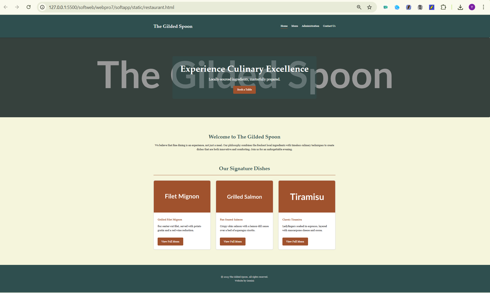
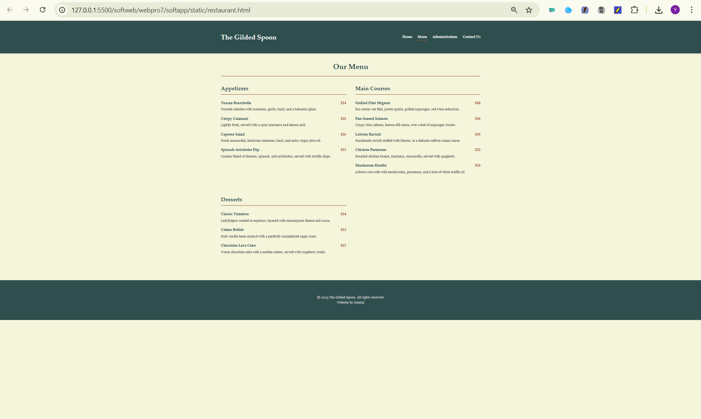
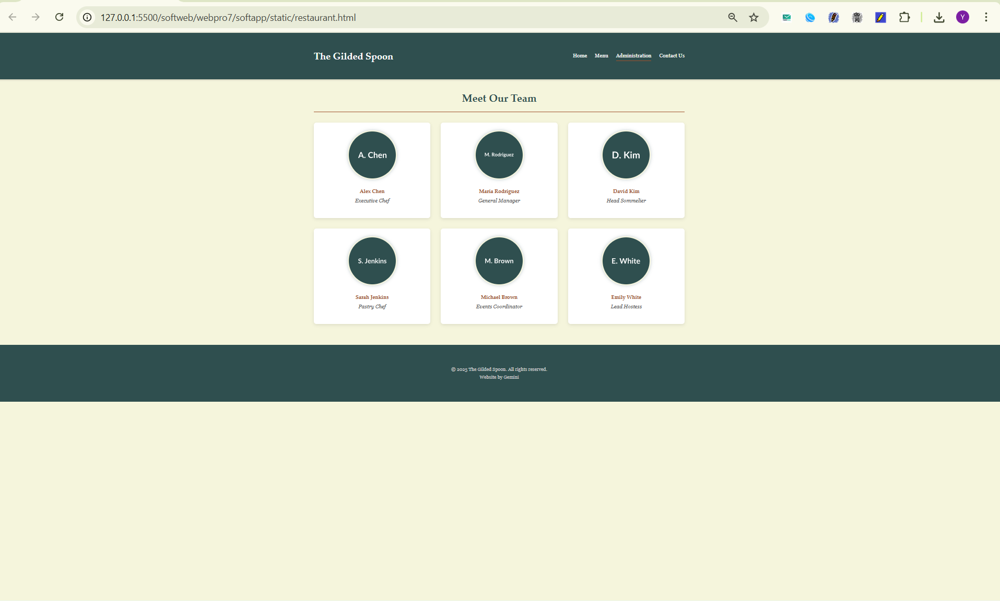

# Ex.07 Restuarant Website
## Date: 24-10-2025

## AIM:
To develop a static Resturant website to display the menu and services provided by the resturant.

## DESIGN STEPS:

### Step 1:
Requirement collection.

### Step 2:
Creating the layout using HTML and CSS.

### Step 3:
Updating the sample content.

### Step 4:
Choose the appropriate style and color scheme.

### Step 5:
Validate the layout in various browsers.

### Step 6:
Validate the HTML code.

### Step 7:
Publish the website in the given URL.

## PROGRAM:
```
<!DOCTYPE html>
<html lang="en">
<head>
    <meta charset="UTF-8">
    <meta name="viewport" content="width=device-width, initial-scale=1.0">
    <title>The Gilded Spoon - Culinary Excellence</title>
    <!-- 
      STYLE - All custom CSS is in this <style> tag.
      No external frameworks are used, as requested.
    -->
    <style>
        /* --- Base & Typography --- */
        * {
            box-sizing: border-box;
            margin: 0;
            padding: 0;
        }

        body {
            /* Color Scheme: 
              Background: #F5F5DC (Beige)
              Text: #333333 (Dark Gray)
            */
            font-family: Georgia, 'Times New Roman', Times, serif;
            line-height: 1.6;
            background-color: #F5F5DC;
            color: #333;
        }

        h1, h2, h3, h4, h5, h6 {
            font-family: 'Palatino Linotype', 'Book Antiqua', Palatino, serif;
            margin-bottom: 1rem;
            color: #2F4F4F; /* Dark Slate Gray */
        }

        h1 { font-size: 2.5rem; }
        h2 { font-size: 2rem; }
        h3 { font-size: 1.5rem; }

        p {
            margin-bottom: 1rem;
        }

        img {
            max-width: 100%;
            height: auto;
            border-radius: 8px;
        }

        .container {
            max-width: 1200px;
            margin: 0 auto;
            padding: 2rem;
        }

        /* --- Header & Navigation --- */
        header {
            /* Color Scheme: Primary/Header: #2F4F4F (Dark Slate Gray) */
            background-color: #2F4F4F;
            color: #fff;
            padding: 1rem 2rem;
            box-shadow: 0 2px 5px rgba(0,0,0,0.2);
            position: sticky;
            top: 0;
            z-index: 100;
        }

        nav {
            display: flex;
            justify-content: space-between;
            align-items: center;
            flex-wrap: wrap;
        }

        nav .logo {
            font-size: 1.8rem;
            font-weight: bold;
            font-family: 'Palatino Linotype', 'Book Antiqua', Palatino, serif;
            text-decoration: none;
            color: #fff;
        }

        nav ul {
            list-style: none;
            display: flex;
        }

        nav ul li {
            margin-left: 1.5rem;
        }

        nav ul li a {
            color: #fff;
            text-decoration: none;
            font-size: 1rem;
            cursor: pointer;
            padding-bottom: 5px;
            transition: border-bottom 0.3s ease;
        }

        /* Color Scheme: Accent: #A0522D (Sienna) */
        nav ul li a:hover,
        nav ul li a.active {
            border-bottom: 2px solid #A0522D;
        }
        
        /* --- General Page Structure --- */
        /* This JS-controlled system hides all pages except the active one */
        .page {
            display: none; /* Hidden by default */
            animation: fadeIn 0.5s ease-in-out;
        }

        .page.active {
            display: block; /* Shown by JS */
        }

        @keyframes fadeIn {
            from { opacity: 0; transform: translateY(10px); }
            to { opacity: 1; transform: translateY(0); }
        }

        /* --- Reusable Components (Buttons, Grids) --- */
        .btn {
            display: inline-block;
            /* Color Scheme: Accent: #A0522D (Sienna) */
            background-color: #A0522D;
            color: #fff;
            padding: 0.75rem 1.5rem;
            text-decoration: none;
            border: none;
            border-radius: 5px;
            cursor: pointer;
            font-size: 1rem;
            font-family: Georgia, 'Times New Roman', Times, serif;
            transition: background-color 0.3s ease, transform 0.2s ease;
        }

        .btn:hover {
            background-color: #8B4513; /* Darker Sienna */
            transform: translateY(-2px);
            box-shadow: 0 4px 8px rgba(0,0,0,0.1);
        }

        .section-header {
            text-align: center;
            margin-bottom: 2rem;
            padding-bottom: 1rem;
            border-bottom: 2px solid #A0522D;
        }

        /* --- Page: Home --- */
        .hero {
            position: relative;
            text-align: center;
            color: white;
            height: 500px;
            display: flex;
            align-items: center;
            justify-content: center;
            border-radius: 8px;
            overflow: hidden;
            margin-bottom: 2rem;
        }

        .hero-image {
            /* This is the banner image */
            background: url('https://placehold.co/1600x600/5A6D65/FFFFFF?text=The+Gilded+Spoon') no-repeat center center/cover;
            position: absolute;
            top: 0;
            left: 0;
            width: 100%;
            height: 100%;
            z-index: -1;
            filter: brightness(0.6);
        }

        .hero-text {
            background: rgba(47, 79, 79, 0.5); /* Semi-transparent Dark Slate Gray */
            padding: 2rem 3rem;
            border-radius: 8px;
        }

        .hero-text h1 {
            color: #fff;
            font-size: 3.5rem;
            margin-bottom: 0.5rem;
        }

        .hero-text p {
            font-size: 1.25rem;
            margin-bottom: 1.5rem;
        }

        .home-section {
            padding: 2rem 0;
            text-align: center;
        }

        .featured-grid {
            display: grid;
            grid-template-columns: repeat(3, 1fr);
            gap: 2rem;
            text-align: left;
        }

        .featured-item {
            background: #fff;
            border: 1px solid #ddd;
            border-radius: 8px;
            box-shadow: 0 2px 5px rgba(0,0,0,0.05);
            overflow: hidden;
        }

        .featured-item img {
            width: 100%;
            height: 200px;
            object-fit: cover;
            border-radius: 8px 8px 0 0;
        }

        .featured-item-content {
            padding: 1.5rem;
        }
        
        .featured-item-content h4 {
            color: #A0522D;
        }
        
        .featured-item-content .btn {
            margin-top: 1rem;
        }

        /* --- Page: Menu --- */
        .menu-grid {
            display: grid;
            grid-template-columns: 1fr 1fr;
            gap: 2.5rem;
        }

        .menu-category {
            margin-bottom: 2rem;
        }

        .menu-category h3 {
            border-bottom: 2px solid #A0522D;
            padding-bottom: 0.5rem;
            margin-bottom: 1.5rem;
        }
        
        .menu-item {
            margin-bottom: 1rem;
        }
        
        .menu-item h4 {
            display: flex;
            justify-content: space-between;
            align-items: center;
            color: #2F4F4F;
            margin-bottom: 0.25rem;
        }
        
        .menu-item h4 span:first-child {
            margin-right: 1rem;
        }

        .menu-item h4 .price {
            color: #A0522D;
            font-weight: bold;
            flex-shrink: 0;
        }
        
        .menu-item p {
            font-size: 0.9rem;
            color: #555;
        }

        /* --- Page: Administration --- */
        .admin-grid {
            display: grid;
            grid-template-columns: repeat(3, 1fr);
            gap: 2rem;
            text-align: center;
        }

        .team-card {
            background: #fff;
            padding: 1.5rem;
            border-radius: 8px;
            box-shadow: 0 4px 10px rgba(0,0,0,0.1);
        }

        .team-card img {
            width: 150px;
            height: 150px;
            border-radius: 50%;
            object-fit: cover;
            border: 4px solid #F5F5DC;
            box-shadow: 0 0 10px rgba(47, 79, 79, 0.3);
            margin-bottom: 1rem;
        }
        
        .team-card h4 {
            color: #A0522D;
            margin-bottom: 0.25rem;
        }
        
        .team-card p {
            font-size: 1rem;
            color: #555;
            font-style: italic;
        }

        /* --- Page: Contact --- */
        .contact-grid {
            display: grid;
            grid-template-columns: 1fr 1fr;
            gap: 3rem;
            background: #fff;
            padding: 2rem;
            border-radius: 8px;
            box-shadow: 0 4px 10px rgba(0,0,0,0.1);
        }
        
        .contact-info p {
            font-size: 1.1rem;
            margin-bottom: 1.5rem;
        }
        
        .contact-info strong {
            color: #2F4F4F;
        }

        .contact-map img {
            width: 100%;
            height: 300px;
            object-fit: cover;
        }

        form label {
            display: block;
            margin-bottom: 0.5rem;
            font-weight: bold;
            color: #2F4F4F;
        }

        form input[type="text"],
        form input[type="email"],
        form textarea {
            width: 100%;
            padding: 0.75rem;
            margin-bottom: 1rem;
            border: 1px solid #ccc;
            border-radius: 5px;
            font-family: Georgia, 'Times New Roman', Times, serif;
            font-size: 1rem;
        }
        
        form textarea {
            resize: vertical;
            min-height: 150px;
        }

        /* --- Footer --- */
        footer {
            /* Color Scheme: Primary/Footer: #2F4F4F (Dark Slate Gray) */
            background-color: #2F4F4F;
            color: #ccc;
            text-align: center;
            padding: 2rem;
            margin-top: 2rem;
        }
        
        footer p {
            margin: 0;
            font-size: 0.9rem;
        }

        /* --- Responsive Design --- */
        @media (max-width: 768px) {
            h1 { font-size: 2rem; }
            h2 { font-size: 1.8rem; }
            .hero-text h1 { font-size: 2.5rem; }
            
            nav {
                flex-direction: column;
                align-items: flex-start;
            }
            
            nav .logo {
                margin-bottom: 1rem;
            }

            nav ul {
                width: 100%;
                justify-content: space-around;
            }
            
            nav ul li {
                margin: 0 0.5rem;
            }

            .featured-grid,
            .menu-grid,
            .admin-grid,
            .contact-grid {
                grid-template-columns: 1fr;
            }
            
            .hero {
                height: 300px;
            }

            .hero-text {
                padding: 1.5rem;
            }
        }

    </style>
</head>
<body>

    <!-- ======== HEADER & NAVIGATION ======== -->
    <header>
        <nav class="container">
            <a href="#" class="logo" data-page="page-home">The Gilded Spoon</a>
            <ul>
                <li><a href="#" class="nav-link active" data-page="page-home">Home</a></li>
                <li><a href="#" class="nav-link" data-page="page-menu">Menu</a></li>
                <li><a href="#" class="nav-link" data-page="page-admin">Administration</a></li>
                <li><a href="#" class="nav-link" data-page="page-contact">Contact Us</a></li>
            </ul>
        </nav>
    </header>

    <!-- ======== PAGE CONTENT CONTAINER ======== -->
    <!-- All "pages" are inside this main tag -->
    <main>

        <!-- ======== PAGE 1: HOME ======== -->
        <section id="page-home" class="page active">
            
            <!-- Hero Section -->
            <div class="hero">
                <div class="hero-image"></div>
                <div class="hero-text">
                    <h1>Experience Culinary Excellence</h1>
                    <p>Locally-sourced ingredients, masterfully prepared.</p>
                    <a href="#" class="btn cta-book">Book a Table</a>
                </div>
            </div>

            <div class="container">
                <!-- Welcome Section -->
                <section class="home-section">
                    <h2>Welcome to The Gilded Spoon</h2>
                    <p>We believe that fine dining is an experience, not just a meal. Our philosophy combines the freshest local ingredients with timeless culinary techniques to create dishes that are both innovative and comforting. Join us for an unforgettable evening.</p>
                </section>

                <!-- Featured Dishes Section -->
                <section class="home-section">
                    <h2 class="section-header">Our Signature Dishes</h2>
                    <div class="featured-grid">
                        <div class="featured-item">
                            
                            <div class="featured-item-content">
                                <h4>Grilled Filet Mignon</h4>
                                <p>8oz center-cut filet, served with potato gratin and a red wine reduction.</p>
                                <a href="#" class="btn cta-menu">View Full Menu</a>
                            </div>
                        </div>
                        <div class="featured-item">
                            
                            <div class="featured-item-content">
                                <h4>Pan-Seared Salmon</h4>
                                <p>Crispy-skin salmon with a lemon-dill sauce over a bed of asparagus risotto.</p>
                                <a href="#" class="btn cta-menu">View Full Menu</a>
                            </div>
                        </div>
                        <div class="featured-item">
                            
                            <div class="featured-item-content">
                                <h4>Classic Tiramisu</h4>
                                <p>Ladyfingers soaked in espresso, layered with mascarpone cheese and cocoa.</p>
                                <a href="#" class="btn cta-menu">View Full Menu</a>
                            </div>
                        </div>
                    </div>
                </section>
            </div>
        </section>

        <!-- ======== PAGE 2: MENU ======== -->
        <section id="page-menu" class="page">
            <div class="container">
                <h2 class="section-header">Our Menu</h2>
                <div class="menu-grid">
                    
                    <!-- Category 1: Appetizers -->
                    <div class="menu-category">
                        <h3>Appetizers</h3>
                        <div class="menu-item">
                            <h4><span>Tuscan Bruschetta</span> <span class="price">$14</span></h4>
                            <p>Toasted ciabatta with tomatoes, garlic, basil, and a balsamic glaze.</p>
                        </div>
                        <div class="menu-item">
                            <h4><span>Crispy Calamari</span> <span class="price">$18</span></h4>
                            <p>Lightly fried, served with a spicy marinara and lemon aioli.</p>
                        </div>
                        <div class="menu-item">
                            <h4><span>Caprese Salad</span> <span class="price">$16</span></h4>
                            <p>Fresh mozzarella, heirloom tomatoes, basil, and extra virgin olive oil.</p>
                        </div>
                        <div class="menu-item">
                            <h4><span>Spinach Artichoke Dip</span> <span class="price">$15</span></h4>
                            <p>Creamy blend of cheeses, spinach, and artichokes, served with tortilla chips.</p>
                        </div>
                    </div>

                    <!-- Category 2: Main Courses -->
                    <div class="menu-category">
                        <h3>Main Courses</h3>
                        <div class="menu-item">
                            <h4><span>Grilled Filet Mignon</span> <span class="price">$48</span></h4>
                            <p>8oz center-cut filet, potato gratin, grilled asparagus, red wine reduction.</p>
                        </div>
                        <div class="menu-item">
                            <h4><span>Pan-Seared Salmon</span> <span class="price">$36</span></h4>
                            <p>Crispy-skin salmon, lemon-dill sauce, over a bed of asparagus risotto.</p>
                        </div>
                        <div class="menu-item">
                            <h4><span>Lobster Ravioli</span> <span class="price">$38</span></h4>
                            <p>Handmade ravioli stuffed with lobster, in a delicate saffron cream sauce.</p>
                        </div>
                        <div class="menu-item">
                            <h4><span>Chicken Parmesan</span> <span class="price">$32</span></h4>
                            <p>Breaded chicken breast, marinara, mozzarella, served with spaghetti.</p>
                        </div>
                        <div class="menu-item">
                            <h4><span>Mushroom Risotto</span> <span class="price">$28</span></h4>
                            <p>Arborio rice with wild mushrooms, parmesan, and a hint of white truffle oil.</p>
                        </div>
                    </div>

                    <!-- Category 3: Desserts -->
                    <div class="menu-category">
                        <h3>Desserts</h3>
                        <div class="menu-item">
                            <h4><span>Classic Tiramisu</span> <span class="price">$14</span></h4>
                            <p>Ladyfingers soaked in espresso, layered with mascarpone cheese and cocoa.</p>
                        </div>
                        <div class="menu-item">
                            <h4><span>Crème Brûlée</span> <span class="price">$13</span></h4>
                            <p>Rich vanilla bean custard with a perfectly caramelized sugar crust.</p>
                        </div>
                        <div class="menu-item">
                            <h4><span>Chocolate Lava Cake</span> <span class="price">$15</span></h4>
                            <p>Warm chocolate cake with a molten center, served with raspberry coulis.</p>
                        </div>
                    </div>
                </div>
            </div>
        </section>

        <!-- ======== PAGE 3: ADMINISTRATION ======== -->
        <section id="page-admin" class="page">
            <div class="container">
                <h2 class="section-header">Meet Our Team</h2>
                <div class="admin-grid">
                    
                    <div class="team-card">
                        
                        <h4>Alex Chen</h4>
                        <p>Executive Chef</p>
                    </div>
                    
                    <div class="team-card">
                        
                        <h4>Maria Rodriguez</h4>
                        <p>General Manager</p>
                    </div>

                    <div class="team-card">
                        
                        <h4>David Kim</h4>
                        <p>Head Sommelier</p>
                    </div>

                    <div class="team-card">
                        
                        <h4>Sarah Jenkins</h4>
                        <p>Pastry Chef</p>
                    </div>

                    <div class="team-card">
                        
                        <h4>Michael Brown</h4>
                        <p>Events Coordinator</p>
                    </div>

                    <div class="team-card">
                        
                        <h4>Emily White</h4>
                        <p>Lead Hostess</p>
                    </div>
                    
                </div>
            </div>
        </section>

        <!-- ======== PAGE 4: CONTACT US ======== -->
        <section id="page-contact" class="page">
            <div class="container">
                <h2 class="section-header">Get In Touch</h2>
                <div class="contact-grid">
                    
                    <!-- Contact Info -->
                    <div class="contact-info">
                        <h3>Visit Us</h3>
                        <p>
                            <strong>Address:</strong><br>
                            123 Culinary Lane<br>
                            Gourmet City, ST 12345
                        </p>
                        <p>
                            <strong>Phone:</strong><br>
                            (123) 456-7890
                        </p>
                        <p>
                            <strong>Email:</strong><br>
                            reservations@gildedspoon.com
                        </p>
                        
                        <div class="contact-map">
                            
                        </div>
                    </div>

                    <!-- Contact Form -->
                    <div class="contact-form">
                        <h3>Send Us a Message</h3>
                        <form id="contactForm">
                            <label for="name">Name</label>
                            <input type="text" id="name" name="name" required>
                            
                            <label for="email">Email</label>
                            <input type="email" id="email" name="email" required>
                            
                            <label for="message">Message</label>
                            <textarea id="message" name="message" required></textarea>
                            
                            <button type="submit" class="btn">Send Message</button>
                        </form>
                    </div>
                </div>
            </div>
        </section>

    </main>

    <!-- ======== FOOTER ======== -->
    <footer>
        <div class="container">
            <p>&copy; 2025 The Gilded Spoon. All rights reserved.</p>
            <!-- Requirement: Mention your name in the footer. -->
            <p>Website by Gemini</p>
        </div>
    </footer>

    <!-- ======== JAVASCRIPT ======== -->
    <!-- This script handles the single-page navigation -->
    <script>
        document.addEventListener('DOMContentLoaded', () => {
            const navLinks = document.querySelectorAll('.nav-link');
            const pages = document.querySelectorAll('.page');
            const ctaBook = document.querySelector('.cta-book');
            const ctaMenuLinks = document.querySelectorAll('.cta-menu');
            const logoLink = document.querySelector('.logo');
            const contactForm = document.getElementById('contactForm');

            // Function to show a page and update active link
            function showPage(pageId) {
                // Hide all pages
                pages.forEach(page => {
                    page.classList.remove('active');
                });
                
                // Deactivate all nav links
                navLinks.forEach(link => {
                    link.classList.remove('active');
                });
                
                // Show the target page
                const targetPage = document.getElementById(pageId);
                if (targetPage) {
                    targetPage.classList.add('active');
                }
                
                // Activate the target nav link
                const targetLink = document.querySelector(`.nav-link[data-page="${pageId}"]`);
                if (targetLink) {
                    targetLink.classList.add('active');
                }
            }

            // Add click listeners to all nav links
            navLinks.forEach(link => {
                link.addEventListener('click', (e) => {
                    e.preventDefault();
                    const pageId = link.getAttribute('data-page');
                    showPage(pageId);
                    window.scrollTo(0, 0); // Scroll to top on page change
                });
            });

            // Add click listener to logo
            logoLink.addEventListener('click', (e) => {
                e.preventDefault();
                showPage('page-home');
                window.scrollTo(0, 0);
            });

            // Add click listener to "Book a Table" CTA
            if (ctaBook) {
                ctaBook.addEventListener('click', (e) => {
                    e.preventDefault();
                    showPage('page-contact');
                    window.scrollTo(0, 0);
                });
            }

            // Add click listeners to "View Full Menu" CTAs
            ctaMenuLinks.forEach(link => {
                link.addEventListener('click', (e) => {
                    e.preventDefault();
                    showPage('page-menu');
                    window.scrollTo(0, 0);
                });
            });

            // Handle contact form submission
            if (contactForm) {
                contactForm.addEventListener('submit', (e) => {
                    e.preventDefault();
                    // In a real site, this would send data.
                    // Here we just show a custom message.
                    alert('Thank you for your message! We will get back to you soon.');
                    contactForm.reset();
                });
            }

            // Show the home page by default on load
            showPage('page-home');
        });
    </script>

</body>
</html>

```

## OUTPUT:







## RESULT:
The program for designing software company website using HTML and CSS is completed successfully.
